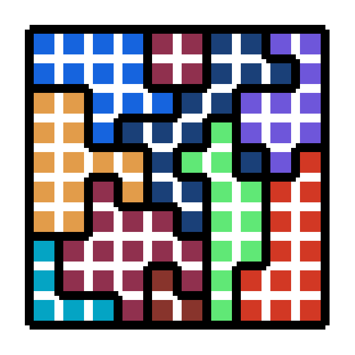
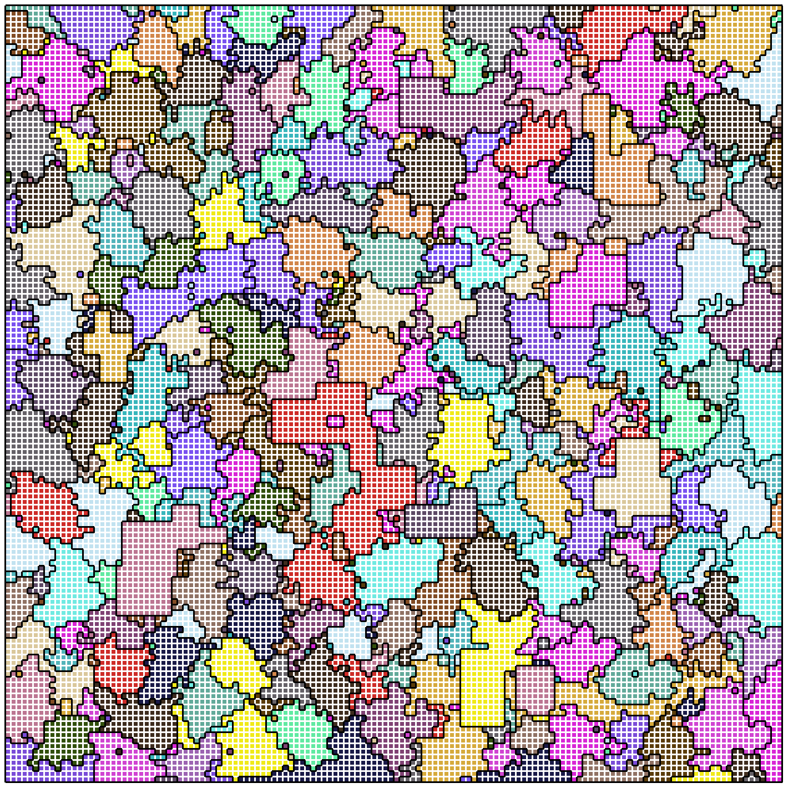
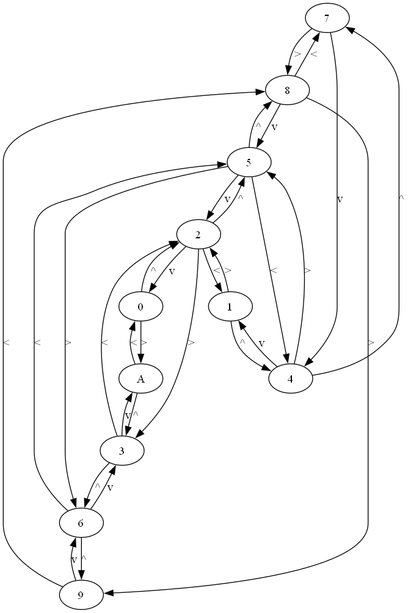

# Advent of Code 2024
Solutions to AOC puzzles.

### Installation

```commandline
pip install icecream
pip install pygame
pip install sympy
pip install networkx
pip install matplotlib
```

### Day 10: Hoof It

Higher locations in lighter green. Trailheads are red. Lighter red means higher rating.


### Day 12: Garden Groups

Small test garden.



The puzzle input garden.



### Day 16: Reindeer Maze

Graph that represents topology of first example maze.


### Day 21: Keypad Conundrum

Graph that represents topology of numeric keypad.


